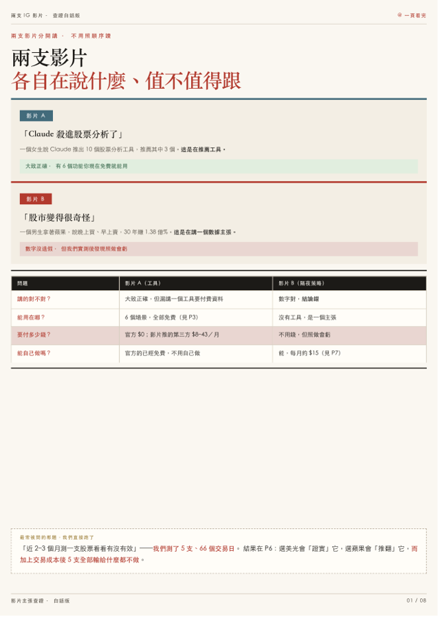
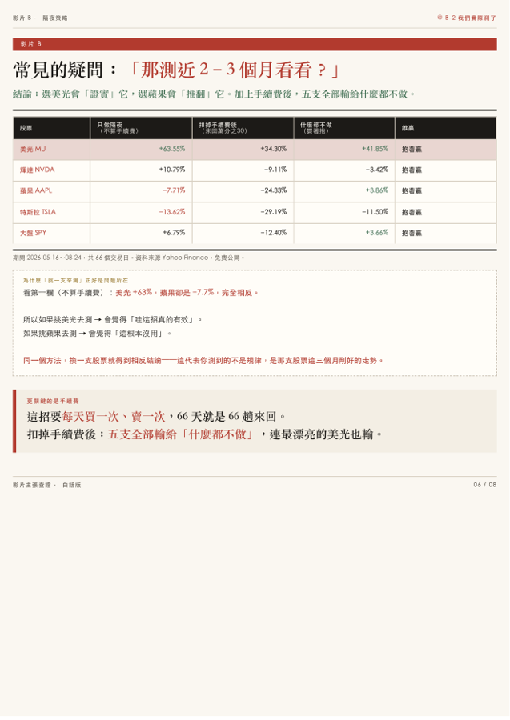

<div align="center">

# reel-research · 短影音研究報告

### 丟一支影片進去，回一份看得懂、查得證、可行動的報告
### Drop a reel in, get a researched, verifiable, actionable report out

**不只是 fact-check。講工具就驗工具能不能用，講地點就查在哪與怎麼訂，講事實才做查證——研究路徑跟著內容型態走。**
**Not just fact-checking. Tools get tested, places get located, claims get verified — the research path adapts to the content.**

[](LICENSE)


**[繁體中文](#繁體中文)** · **[English](#english)**

<p align="center">
  
  
</p>

<sub><b>兩種完全不同的影片，同一套流程。</b>左：數據主張型（隔夜策略實測）· 右：工具型（旁白一個名字都沒念，從畫面認出 13 個工具）<br/>
Two very different reels, one pipeline. Left: a data claim, tested. Right: 13 tools identified from frames alone.</sub>

<br/>

<p align="center">
  
  
  
</p>

<sub>實測表 · 成本對照 · 從畫面認工具<br/>Empirical test · cost comparison · identifying tools from frames</sub>

</div>

---

<a name="繁體中文"></a>

## 繁體中文

### 這是什麼

短影音很會講，但**看完不知道能不能信、也不知道下一步要幹嘛**。

這個 repo 是一套流程：**丟一支 IG／短影音連結進去，回一份 A4 報告**——把影片拆開、判斷它在講什麼類型、走對應的研究路徑、然後給你一份可以直接行動的東西。

**重點不是結論，是方法。** 每個數字附來源，每個腳本都能自己重跑。

### 核心：先判斷類型，再決定怎麼研究

同一套「查證」對所有影片一視同仁是沒用的。講工具的影片，你要的是「這工具現在能不能用、多少錢」；講旅遊的影片，你要的是「在哪、評價如何、怎麼訂」。所以流程的第一步是**分流**：

| 類型 | 影片在幹嘛 | 研究路徑 | 你最後拿到什麼 |
|---|---|---|---|
| **A 工具／產品** | 推薦或展示某個 App、AI 工具 | 從畫面 logo 與文字標籤推斷是哪個工具 → 查官網現況 → 查價格 → 可能的話**實際裝來跑** | 工具清單 ＋ 現在能不能用 ＋ 真實價格 ＋ 誰能用 |
| **B 事實／數據主張** | 「30 年賺 1.38 億%」這種 | 找一手來源 → 查方法論批評 → **自己抓資料重算一次** | 逐條真偽 ＋ 自己跑的實測表 |
| **C 地點／旅遊／餐廳** | 景點、餐廳、行程 | 從畫面招牌／地標定位 → 查地址營業時間 → 查多平台評價 → **查怎麼訂位／購票** | 地點清單 ＋ 地圖連結 ＋ 評價 ＋ 訂位方式 |
| **D 教學／How-to** | 步驟示範 | 步驟拆解 → 前置條件 → **實際照做一次** | 可執行步驟 ＋ 卡住的地方 |
| **E 開箱／購物** | 商品推薦 | 認出型號 → 比價 → 找負評 | 型號 ＋ 目前價格 ＋ 反面意見 |
| **F 混合** | 同時有好幾種 | 拆成多個區塊，各走各的路徑 | 分區塊的報告 |

> 完整路由規則在 skill 的 `references/routing.md`。

### 兩個實例

#### 範例 1 · 財經影音：AI 選股工具 ＋ 隔夜策略（B 型 ＋ A 型）

📄 [`reports/01-stock-tools/report.pdf`](reports/01-stock-tools/report.pdf) · 🌐 [HTML](reports/01-stock-tools/report.html)

兩支影片：一支推薦 AI 選股工具，一支秀出「每天收盤買、開盤賣，30 年賺 1.38 億%」的圖表。

**沒有停在「數字有沒有造假」——直接自己抓股價算一遍**，5 支股票、66 個交易日：

| 股票 | 隔夜（不算手續費） | 扣 30bps 手續費 | 什麼都不做 | 誰贏 |
|---|---|---|---|---|
| MU | +63.55% | +34.30% | **+41.85%** | 抱著贏 |
| NVDA | +10.79% | −9.11% | **−3.42%** | 抱著贏 |
| AAPL | **−7.71%** ← 相反 | −24.33% | **+3.86%** | 抱著贏 |
| TSLA | **−13.62%** ← 相反 | −29.19% | **−11.50%** | 抱著贏 |
| SPY | +6.79% | −12.40% | **+3.66%** | 抱著贏 |

1. **挑哪一支決定你的結論。** 挑 MU 覺得超有效，挑 AAPL 覺得根本沒用——同一個方法換一支股票就得到相反答案，**這代表測到的不是規律，是那支股票剛好的走勢**。
2. **扣掉手續費後五支全輸給「什麼都不做」**，連最漂亮的 MU 也輸。這招每天進出一次，66 天就是 66 趟來回。

附一份**活公式** Excel [`data/隔夜策略手續費試算.xlsx`](data/隔夜策略手續費試算.xlsx)：改參數分頁的黃色格子（bps），逐日明細、五支彙總、成本敏感度三個分頁自動重算，每一格都點得進去看公式。

#### 範例 2 · AI 工具影音：旁白一個名字都沒念（A 型）

📄 [`reports/02-ai-stack/report.pdf`](reports/02-ai-stack/report.pdf) · 🌐 [HTML](reports/02-ai-stack/report.html)

一支「My August 2026 AI Stack」的 reel，旁白從頭到尾只說 *content lives here / automation runs here / research happens here*——**13 個工具名稱一個都沒念出來**，全部只在畫面的 logo 卡片上。

這正是「工具型影片」路徑存在的理由。做法與結果：

- **逐秒硬抽幀**（不是場景變化偵測）。這支影片背景幾乎不動，`--scene-threshold 0.18` 只抓到 **1 幀**，整支影片的資訊會全部漏光。改成每 1.5 秒硬抽一張，才拿到全部 7 組卡片。
- **文字標籤優先於 logo 外觀**。獨立查證員把橘底白閃電判成 Zapier（合理，那正是 Zapier 的經典配色），但放大後文字標籤清楚寫著 **Cowork**。
- **認出來之後還要驗「現在能不能用」**：13 個全部真實存在且可用，但 **1 個已改名**（NotebookLM → Gemini Notebook）、**1 個免費額度即將到期**（Fish Audio API 8/31）、而且**實際只需要 8 個帳號**——Codex 與 ChatGPT Images 2.0 含在 ChatGPT 訂閱、Cowork 含在 Claude 訂閱、Nano Banana 2 含在 Gemini 裡。

> **這三件事影片都沒講，但決定你要不要照抄。**

### 自己重跑（範例 1 的數據）

```bash
pip install yfinance pandas numpy openpyxl
python3 data/overnight_test.py          # 隔夜 vs 日內，含「兩半乘回去=總報酬」驗算
python3 data/overnight_with_costs.py    # 加上 10/30bps 成本
python3 data/build_xlsx.py              # 重新產出 Excel
```

資料來源 Yahoo Finance，免費公開。**改 `TICKERS` 就能測你自己的股票。**

### 流程長什麼樣

1. **拆影片**——抽幀＋逐字稿。**畫面字卡優先於語音逐字稿**（中文 ASR 對專有名詞漂字嚴重），caption 也要另外抓（caption 常宣稱畫面沒演的東西）
2. **判斷類型**——走上面那張路由表，選對研究路徑
3. **依路徑研究**——工具就驗可用性與價格；主張就找一手來源＋方法論批評＋**自己重算**；地點就定位＋評價＋訂位方式
4. **失效模式過篩**——拆分幻覺、選樣偏誤、成本消失、量級偷換、時效腐爛……共十類
5. **產報告**——A4 印刷稿版型，每頁一句白話總結，每個概念配生活比喻，交付前跑三道機械檢查（頁數 1:1／中文字數／每頁墨水覆蓋率）＋肉眼逐頁看

### 幾個踩過的坑（直接寫進流程了）

| 坑 | 後果 | 現在怎麼做 |
|---|---|---|
| 用場景變化偵測抽幀 | 靜態畫面的影片只抽到 1 幀，整支漏光 | 判斷是否靜態，是就**逐秒硬抽** |
| 相信 logo 外觀 | 把 Cowork 認成 Zapier | **有文字標籤時文字優先** |
| 只測一支股票 | 挑到什麼決定結論 | 至少 4–5 支 ＋ 大盤對照組 |
| 高頻策略不扣成本 | 數字沒有意義 | 一律給 0／10／30bps 三欄 |
| 不同單位並排比 | 「15 次請求」vs「3,000 則貼文」讀者看不出東西 | 換算成同一單位再比 |
| 機械檢查過了就交付 | 抓不到「表格排版壞掉但字都在」 | **必須肉眼逐頁看** |

### 免責

工具可用性查證與成本試算，**不含個股買賣建議，也不含工具推薦或代言**。價格與費率為 2026-08 實測，會變動。影片內容一律視為**待驗證資料**。

---

<a name="english"></a>

## English

### What this is

Short-form video is persuasive, but you finish watching **without knowing whether to believe it, or what to do next**.

This repo is a pipeline: **drop in a reel link, get back an A4 report** — the video is broken down, its content type is identified, the matching research path runs, and you get something you can act on.

**The point isn't the conclusion — it's the method.** Every figure has a source; every script runs.

### The core idea: classify first, then research

One generic "fact-check" doesn't fit every video. For a tool video you want *does it still work and what does it cost*; for a travel video you want *where is it, is it any good, how do I book*. So step one is **routing**:

| Type | What the reel does | Research path | What you get |
|---|---|---|---|
| **A Tools / products** | Recommends or demos an app or AI tool | Infer the tool from on-screen logos and text labels → check the official site → check pricing → **install and run it** where possible | Tool list + availability + real pricing + who can actually use it |
| **B Factual / data claims** | "+138M% over 30 years" and the like | Find the primary source → look for methodology criticism → **pull the data and recompute** | Claim-by-claim verdicts + your own empirical table |
| **C Places / travel / food** | Spots, restaurants, itineraries | Locate from signage and landmarks → address and hours → multi-platform reviews → **how to book** | Place list + map links + reviews + booking route |
| **D Tutorials / how-to** | Step-by-step demos | Decompose steps → prerequisites → **actually follow them once** | Runnable steps + where it breaks |
| **E Unboxing / shopping** | Product recommendations | Identify the model → compare prices → find the negative reviews | Model + current price + the other side |
| **F Mixed** | Several at once | Split into sections, route each separately | Sectioned report |

> Full routing rules live in the skill's `references/routing.md`.

### Two worked examples

#### Example 1 · Finance reels: AI stock tools + an overnight strategy (types B + A)

📄 [`reports/01-stock-tools/report.pdf`](reports/01-stock-tools/report.pdf) · 🌐 [HTML](reports/01-stock-tools/report.html)

Two reels: one recommending AI stock-analysis tools, one showing a chart claiming "buy at close, sell at open → +138,330,342% since 1990."

**It didn't stop at "are the numbers faked" — it pulled the prices and recomputed**, 5 tickers, 66 trading days:

| Ticker | Overnight (no fees) | After 30bps | Buy & hold | Winner |
|---|---|---|---|---|
| MU | +63.55% | +34.30% | **+41.85%** | Buy & hold |
| NVDA | +10.79% | −9.11% | **−3.42%** | Buy & hold |
| AAPL | **−7.71%** ← inverted | −24.33% | **+3.86%** | Buy & hold |
| TSLA | **−13.62%** ← inverted | −29.19% | **−11.50%** | Buy & hold |
| SPY | +6.79% | −12.40% | **+3.66%** | Buy & hold |

1. **Which ticker you pick determines your conclusion.** Pick MU and it looks brilliant; pick AAPL and it looks useless. Same method, opposite answers — **you measured this quarter's price path, not a regularity.**
2. **After realistic fees all five lose to doing nothing**, even MU. The strategy needs a round trip every single day: 66 days = 66 round trips.

Ships with a **live-formula** workbook, [`data/隔夜策略手續費試算.xlsx`](data/隔夜策略手續費試算.xlsx): change the bps in the yellow parameter cell and the daily detail, summary, and sensitivity sheets all recalculate. Every cell is an inspectable formula.

#### Example 2 · An AI-tools reel where zero tool names are ever spoken (type A)

📄 [`reports/02-ai-stack/report.pdf`](reports/02-ai-stack/report.pdf) · 🌐 [HTML](reports/02-ai-stack/report.html)

A "My August 2026 AI Stack" reel. The voiceover says only *content lives here / automation runs here / research happens here* — **not one of the 13 tool names is ever said aloud.** They exist only as logo cards on screen.

This is exactly why the tool path exists. What it did and found:

- **Dense per-second frame extraction, not scene-change detection.** The background barely moves; `--scene-threshold 0.18` captured **one frame** and would have missed the entire video. Forcing a frame every 1.5s recovered all 7 card groups.
- **Text labels beat logo appearance.** An independent verifier called the orange lightning bolt Zapier — reasonable, that's Zapier's signature palette — but zoomed in, the text label plainly reads **Cowork**.
- **Identification isn't the end; availability is.** All 13 exist and work, but **one was renamed** (NotebookLM → Gemini Notebook), **one's free tier expires 8/31** (Fish Audio API), and **you only need 8 accounts** — Codex and ChatGPT Images 2.0 come with ChatGPT, Cowork comes with Claude, Nano Banana 2 comes with Gemini.

> **The reel mentions none of the three, and all three decide whether copying it is worth it.**

### Reproduce it (example 1's data)

```bash
pip install yfinance pandas numpy openpyxl
python3 data/overnight_test.py          # overnight vs intraday, incl. the (1+A)(1+B)-1 = total check
python3 data/overnight_with_costs.py    # with 10/30bps costs applied
python3 data/build_xlsx.py              # regenerate the workbook
```

Data comes from Yahoo Finance — free and public. **Change `TICKERS` to test your own.**

### The pipeline

1. **Break down the reel** — frames + transcript. **On-screen text beats the ASR transcript** (ASR mangles product names), and fetch the caption separately (captions routinely claim things the video never shows)
2. **Classify** — run the routing table above and pick the path
3. **Research along that path** — tools: availability and pricing; claims: primary source + methodology criticism + **recompute it yourself**; places: location + reviews + booking route
4. **Screen against ten failure modes** — decomposition illusion, selection bias, vanished costs, magnitude swap, staleness, and so on
5. **Produce the report** — A4 print-dossier layout, one plain-language takeaway per page, one everyday analogy per concept, and before delivery three mechanical checks (page count 1:1 / CJK character count / per-page ink coverage) **plus an actual page-by-page look**

### Traps already paid for (now baked into the pipeline)

| Trap | Consequence | What the pipeline does now |
|---|---|---|
| Scene-change frame extraction | A static reel yields 1 frame; everything is missed | Detect static reels and **force dense extraction** |
| Trusting logo appearance | Cowork read as Zapier | **When a text label exists, text wins** |
| Testing one ticker | Your pick decides the conclusion | At least 4–5 tickers plus a market benchmark |
| No costs on a high-frequency strategy | The numbers are meaningless | Always show 0 / 10 / 30bps columns |
| Comparing mismatched units | "15 requests" vs "3,000 posts" tells the reader nothing | Convert to a common unit first |
| Shipping once mechanical checks pass | Misses "the table broke but all the text is there" | **Look at every page** |

### Disclaimer

Tool-availability verification and cost estimation. **Not investment advice, and not a product endorsement.** Prices and rates measured 2026-08; they change. Video content is treated as **unverified data** throughout.

---

<div align="center">

### Contact · 合作聯絡

📧 dennis.xd.wei@gmail.com
💼 [LinkedIn](https://www.linkedin.com/in/dennis-wei-47393a14a/)

<sub>MIT License · 報告內容為公開資料查證，可自由引用轉載，請保留出處</sub>

</div>
